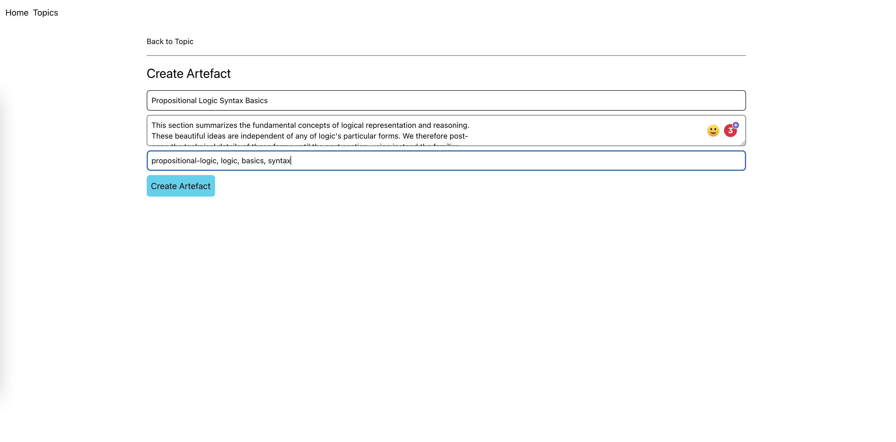

# Study Serve 

Tool for curating snippets and topics for revising for exams or preparing for academic research.

## Concepts
- Topic - a topic is a specific subject of study, for example: Artificial Intelligence Formal Logic
- Artefact - is a snippet relating to a specific topic. For example, a description of a subject that you found to be a useful reference point, or a series of key concepts extracted from text books etc. The content along with an additional field 'tags', will be indexed in search, so you can quickly retrieve this information.

## Components
- Python based REST API (might be moved over to Go eventually, this is just a prototype)
- React UI
- ElasticSearch cluster - topics are created as indices in ElasticSearch, artefacts are indexed under a specific topic/index

## Future plans
- Anki style questions, which uses text vectorisation to allow users to give full written answers, and mark the correctness based on the 'closeness' to the original answer. Rather than one word answers, this will measure how close the answer was to the correct answer, which could be a single word, or full sentances. We will allow the option to set a 'correctness' threshold.
- Attach files to Artefacts, such as PDF's 

## Ideas 
- Snippet creator, something like Pocket, for example. Chrome extension which adds artefacts directly from the browser.
- Fully deployed cloud version, where user's can create accounts and use this as an actual 'thing', perhaps with some premium features.
- Quiz's based on specific artefacts, use text vectorisation to assess 'closeness'
- Quiz's based on topics, similar to just the artefacts one, but more broad based questions.
- Artefacts and Topcis could both have Quiz->Answer sub-types, and track the percentage of correctness over time.

## Example Usage

1. Create an artefact

2. Search artefacts

3. View artefacts

